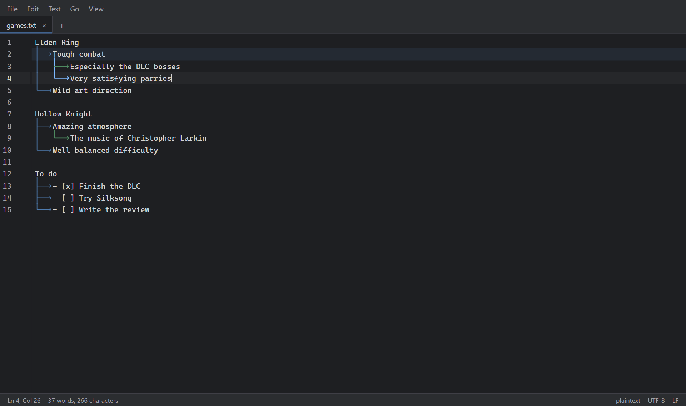
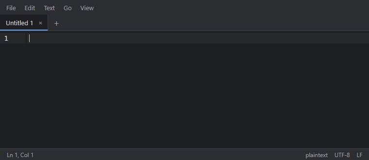
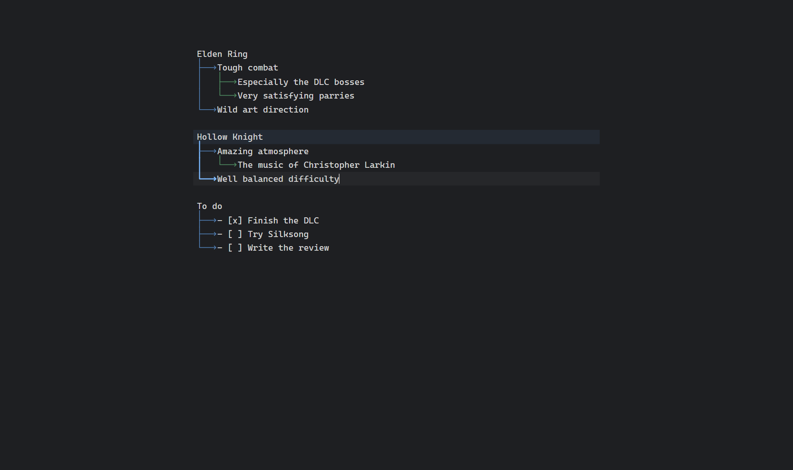

# Cascades

**Un éditeur de texte léger pensé pour la prise de notes, qui reste capable d'ouvrir n'importe quel fichier texte ou code.**
La simplicité de Notepad++, la personnalisation de Vim, une interface moderne.

[Site](https://anderson3x11.github.io/cascades-site/) · [English](README.md)



> Version 1.0, pour Windows, macOS et Linux. Raccourcis et réglages : [documentation](https://anderson3x11.github.io/cascades-site/docs.html).

## Télécharger

La dernière version est sur la [page des Releases](https://github.com/anderson3x11/cascades/releases/latest) :

- **Windows** : `Cascades_…_x64-setup.exe`. Pas besoin de droits administrateur.
- **macOS** (Intel et Apple Silicon) : `Cascades_…_universal.dmg`.
- **Linux** : `.AppImage` (toutes distributions), `.deb` (Debian, Ubuntu) ou `.rpm` (Fedora, openSUSE).

Cascades se met ensuite à jour tout seul : il propose chaque nouvelle version au démarrage, ou par Fichier > Rechercher des mises à jour….

Les installateurs ne sont pas encore signés par un certificat payant. Sous Windows, « Windows a protégé votre ordinateur » peut s'afficher : cliquer sur Informations complémentaires, puis Exécuter quand même. Sous macOS, autoriser l'app dans Réglages Système > Confidentialité et sécurité.

## Les cascades

On écrit ses notes ligne par ligne, et on indente avec Tab une ligne qui découle de celle du dessus. Cascades dessine les liens :



Le fichier ne contient que des tabulations : les traits sont dessinés, jamais écrits, et copier du texte copie les tabulations. Chaque ligne parente se replie, la branche de la ligne courante est mise en valeur, et il y a huit styles (flèches, arrondis, courbes, points, tirets…).

## Fonctionnalités

**Écrire**

- Entrée garde l'indentation exacte, les cascades grandissent au fil de la frappe.
- Listes intelligentes (`-`, `*`, `1.`, `a)`, `- [ ]`) : Entrée continue la liste, Tab et Shift+Tab changent le niveau, les numéros se mettent à jour tout seuls, Ctrl+Entrée coche une tâche.
- Paires automatiques pour les parenthèses et les guillemets (et `**`, `` ` `` en Markdown) ; taper `(`, `"` ou `*` sur une sélection l'entoure.
- Menu Texte : MAJUSCULES, minuscules, Majuscule À Chaque Mot, majuscule en début de phrase ; trier les lignes, supprimer les doublons, les espaces en fin de ligne, joindre des lignes.
- Sélectionner une ligne (Ctrl+L, encore pour la suivante), une cascade ou un paragraphe entier (Leader L) ; signets (Ctrl+F2, F2) ; aller à la ligne (Ctrl+G).
- Correcteur orthographique avec les dictionnaires de Windows, activé et désactivé avec F7 ; corrections au clic droit.
- Les lignes modifiées depuis le dernier enregistrement sont marquées dans la marge, comme dans Notepad++.
- Tableaux Markdown : Tab passe d'une cellule à l'autre en alignant les colonnes. Ctrl+clic ouvre les liens ; coller une adresse sur du texte sélectionné en fait un lien Markdown. Ctrl+; insère la date.
- « Quarantaine » : mettre de côté un passage (Leader Q) pour essayer son texte sans lui, et le replacer n'importe où plus tard.

**Fichiers**


- Onglets, vues scindées (jusqu'à quatre, le même fichier dans plusieurs vues), et session restaurée au démarrage, onglets non enregistrés compris : fermer la fenêtre ne fait rien perdre.
- Explorateur à gauche avec un ou plusieurs dossiers : créer, renommer, mettre à la corbeille. Ouverture rapide (Ctrl+P) parmi les onglets ouverts, les fichiers récents et tous les fichiers des dossiers.
- Rechercher et remplacer dans les fichiers (Ctrl+Shift+F), avec un aperçu de chaque remplacement.
- Encodages (UTF-8, UTF-16, Windows-1252…) et fins de ligne conservés à l'enregistrement ; rouvrir ou convertir depuis la barre d'état. Un fichier modifié par un autre programme est rechargé, ou fusionné avec vos modifications.
- Les gros fichiers s'ouvrent en mode allégé ; les fichiers binaires dans une vue hexadécimale en lecture seule.

**Aperçus**


- Aperçu à côté de l'éditeur ou seul (Ctrl+Shift+V) : Markdown (tableaux, cases à cocher, notes de bas de page, code coloré, images locales), HTML (isolé), SVG, CSV et TSV en tableaux triables, JSON en arbre.
- Les images et les PDF s'ouvrent dans un onglet, avec zoom ; le texte d'un PDF se sélectionne.

**Le personnaliser**


- Sept thèmes (Clair, Sombre, Haut contraste, Solarized clair et sombre, Nord, Gruvbox) et les vôtres ; le mode clair ou sombre du système est suivi par défaut.
- Une fenêtre Préférences (Ctrl+,) pour chaque réglage et chaque raccourci : taper la nouvelle combinaison pour en changer un.
- `settings.json` et `keybindings.json` (format VS Code) avec complétion et vérification des erreurs, rechargés à l'enregistrement.
- Masquer la barre de menus, les onglets ou la barre d'état ; mode zen pour écrire en plein écran.
- Une touche leader (Ctrl+Espace) pour plus de raccourcis, avec une barre qui montre la suite possible.
- Tout est une commande, dans la palette de commandes (Ctrl+Shift+P). Un script `init.js` peut ajouter les vôtres.
- Des plugins, activés et désactivés dans Préférences > Extensions. Voir [Écrire un plugin](docs/plugins.md) (en anglais).



## Raccourcis

| Action                                          | Raccourci                                 |
| ----------------------------------------------- | ----------------------------------------- |
| Nouveau / Ouvrir / Enregistrer                  | Ctrl+N / Ctrl+O / Ctrl+S                  |
| Enregistrer sous                                | Ctrl+Shift+S                              |
| Fermer l'onglet / Rouvrir le dernier fermé      | Ctrl+W / Ctrl+Shift+T                     |
| Onglet suivant / précédent                      | Ctrl+Tab / Ctrl+Shift+Tab                 |
| Ouverture rapide                                | Ctrl+P / Leader O                         |
| Palette de commandes                            | Ctrl+Shift+P / Leader P                   |
| Préférences                                     | Ctrl+,                                    |
| Rechercher / Remplacer                          | Ctrl+F / Ctrl+H                           |
| Rechercher dans les fichiers                    | Ctrl+Shift+F                              |
| Ajouter un dossier / Panneau de gauche          | Ctrl+Shift+O / Ctrl+B                     |
| Aller à la ligne                                | Ctrl+G                                    |
| Signet : poser / suivant / précédent            | Ctrl+F2 / F2 / Shift+F2                   |
| Sélectionner la ligne / retirer la dernière     | Ctrl+L / Ctrl+Shift+L                     |
| Sélectionner la cascade ou le paragraphe        | Leader L                                  |
| MAJUSCULES / minuscules                         | Ctrl+Shift+U / Ctrl+U                     |
| Majuscule À Chaque Mot / en début de phrase     | Leader U / Leader Shift+U                 |
| Dupliquer / Déplacer la ligne                   | Shift+Alt+Bas / Alt+Haut, Alt+Bas         |
| Supprimer la ligne                              | Ctrl+Shift+K                              |
| Commenter                                       | Ctrl+/ (Ctrl+: en AZERTY)                 |
| Ajouter l'occurrence suivante                   | Ctrl+D                                    |
| Cocher / décocher une tâche                     | Ctrl+Entrée                               |
| Insérer la date                                 | Ctrl+;                                    |
| Correcteur orthographique (marche / arrêt)      | F7                                        |
| Aperçu à côté / seul                            | Ctrl+Shift+V ou Leader V / Leader Shift+V |
| Cloner dans la vue suivante                     | Ctrl+\ ou Leader S                        |
| Déplacer vers la vue suivante / précédente      | Ctrl+Alt+→ / Ctrl+Alt+←                   |
| Aller à la vue 1 à 4 / réunir toutes les vues   | Ctrl+1 … Ctrl+4 / Leader J                |
| Afficher / masquer les cascades, celle du bloc  | Leader C / Leader Shift+C                 |
| Mettre en quarantaine / panneau de quarantaine  | Leader Q / Leader Shift+Q                 |
| Thème                                           | Leader T                                  |
| Zoom                                            | Ctrl+= / Ctrl+- / Ctrl+0, Ctrl+molette    |
| Mode zen (Échap pour sortir)                    | Leader Z                                  |
| Afficher / masquer menus, onglets, barre d'état | Leader M / Leader Tab / Leader B          |

**Leader** est la touche leader, **Ctrl+Espace** par défaut (réglage `keyboard.leader`) : on l'appuie, puis la touche suivante. Une barre en bas de la fenêtre affiche alors les touches possibles.

Sur macOS, Cmd remplace Ctrl, sauf pour Ctrl+Tab et la touche leader. Dans `keybindings.json`, `Mod` veut dire Cmd sur macOS et Ctrl ailleurs.

## Configuration

Le dossier de config est :

- Windows : `%APPDATA%\dev.cascades.app\`
- macOS : `~/Library/Application Support/dev.cascades.app/`
- Linux : `~/.config/dev.cascades.app/`

**Mode portable** : placez un fichier vide nommé `portable` à côté de l'exécutable ; la config est alors lue dans un dossier `config` au même endroit.

### settings.json

Chaque réglage se change dans la fenêtre Préférences, qui écrit ce fichier en gardant ses commentaires. Il s'édite aussi à la main (Fichier > Ouvrir settings.json), avec complétion, erreurs soulignées et description au survol :

```jsonc
{
  "editor.fontSize": 15,
  "cascades.style": "rounded",
  // Seulement pour les fichiers Markdown :
  "[markdown]": { "editor.wordWrap": true },
}
```

Quelques réglages utiles :

| Clé                   | Défaut                      | Description                                                         |
| --------------------- | --------------------------- | ------------------------------------------------------------------- |
| `editor.tabSize`      | `4`                         | Largeur d'une tabulation                                            |
| `editor.wordWrap`     | `false`                     | Retour à la ligne automatique                                       |
| `editor.fontFamily`   | `'Cascadia Code', …`        | Police de l'éditeur                                                 |
| `workbench.theme`     | `"auto"`                    | Thème, ou `auto` pour suivre le système                             |
| `cascades.style`      | `"arrow"`                   | `arrow`, `rounded`, `curved`, `bullet`, `line`, `dashed`, `dotted`… |
| `cascades.languages`  | `["plaintext", "markdown"]` | Langages où les cascades sont dessinées                             |
| `files.autoSave`      | `"off"`                     | `afterDelay` enregistre les fichiers modifiés tout seul             |
| `explorer.exclude`    | `[".git", "node_modules"]`  | Noms masqués dans l'explorateur                                     |
| `spellcheck.language` | `"fr"`                      | Langue du correcteur orthographique                                 |
| `keyboard.leader`     | `"Ctrl+Space"`              | La touche leader                                                    |

### keybindings.json

Le format de VS Code : des raccourcis qui s'ajoutent à ceux par défaut ou les remplacent. Un `-` devant la commande retire un raccourci.

```jsonc
[
  { "key": "Ctrl+Shift+N", "command": "file.new" },
  // Ctrl+D ne sélectionne plus l'occurrence suivante
  { "key": "Ctrl+D", "command": "-editor.addNextOccurrence" },
  { "key": "Leader D", "command": "editor.duplicateLine", "when": "editorFocus" },
]
```

### Thèmes

Un thème est un fichier JSON placé dans le sous-dossier `themes` du dossier de config. Il redéfinit les couleurs qu'il veut, les autres viennent de la palette de base de son type :

```json
{
  "name": "Sépia",
  "type": "light",
  "colors": { "bg": "#f4ecd8", "fg": "#433422", "accent": "#a0522d", "syn-keyword": "#8b4513" }
}
```

`themes/sepia.json` donne le thème `user.sepia` (Leader T pour le choisir), rechargé à chaque enregistrement. La liste des couleurs est dans [src/themes/default.css](src/themes/default.css).

### Plugins

Un plugin est un dossier dans le sous-dossier `plugins` du dossier de config, avec un `manifest.json` et un module JavaScript. On l'active dans Préférences > Extensions. Pour en écrire un : [docs/plugins.md](docs/plugins.md) (en anglais).

### init.js

`init.js` est un module JavaScript chargé au démarrage comme une extension. Il reçoit le même objet `ctx` que les fonctionnalités internes : commandes, raccourcis, réglages, onglets, éditeur (CodeMirror 6), barre d'état… Exemple complet : [docs/examples/init.js](docs/examples/init.js).

```js
export default function (ctx) {
  ctx.commands.register('user.hello', () => ctx.dialogs.alert('Bonjour'));
  ctx.keybindings.register({ key: 'Leader H', command: 'user.hello' });
}
```

## Architecture

```
src/
├── core/        Noyau sans UI : commandes, raccourcis, réglages, événements, hôte d'extensions
├── api/         L'API des extensions (la future API de plugins)
├── app/         Assemblage : workbench, onglets, intégration CodeMirror
├── extensions/  Chaque fonctionnalité, écrite uniquement contre src/api
├── platform/    Appels au backend Tauri
└── ui/          Composants Svelte
src-tauri/       Backend Rust : fichiers, encodages, recherche, orthographe, config
```

Chaque fonctionnalité est une extension qui s'active avec `activate(ctx)` ; ce qu'elle enregistre via `ctx` est retiré à sa désactivation. Une règle de lint interdit aux extensions d'importer autre chose que `src/api`.

Technologies : [Tauri 2](https://tauri.app), TypeScript, [Svelte 5](https://svelte.dev), [CodeMirror 6](https://codemirror.net).

## Performances

Mesures du 30/09/2026, version Windows 0.1.0 :

- Installeur 2,8 Mo ; programme installé 6 Mo.
- Interface prête environ 120 ms après l'ouverture de la fenêtre (35 ms quand elle est en cache).
- Frappe fluide dans un fichier de 10 000 lignes avec cascades. Au-delà de 50 Mo, mode allégé ; au-delà de 512 Mo, lecture seule.
- Le lecteur PDF, le rendu Markdown et les langages ne sont chargés qu'à leur première utilisation.

## Développement

Les contributions sont les bienvenues : voir [CONTRIBUTING.md](CONTRIBUTING.md) (en anglais).

Prérequis : Node 20+, Rust stable, et sous Windows les Visual Studio Build Tools (charge de travail C++). Voir les [prérequis Tauri](https://v2.tauri.app/start/prerequisites/).

```sh
npm install
npm run tauri dev      # lance l'application
npm run tauri build    # construit les installeurs
```

Vérifications :

```sh
npm run lint && npm run check && npm test
npm run test:e2e       # tests Playwright dans un navigateur (frontend seul)
cd src-tauri && cargo test && cargo clippy && cargo fmt --check
```

`npm run dev` lance le frontend seul dans un navigateur, sur un disque en mémoire. `npm run screenshots` prend les images de ce README. `npm run docs` écrit `docs/reference.json`, la liste des commandes, raccourcis et réglages que le site affiche.

## Licence

[MIT](LICENSE)
