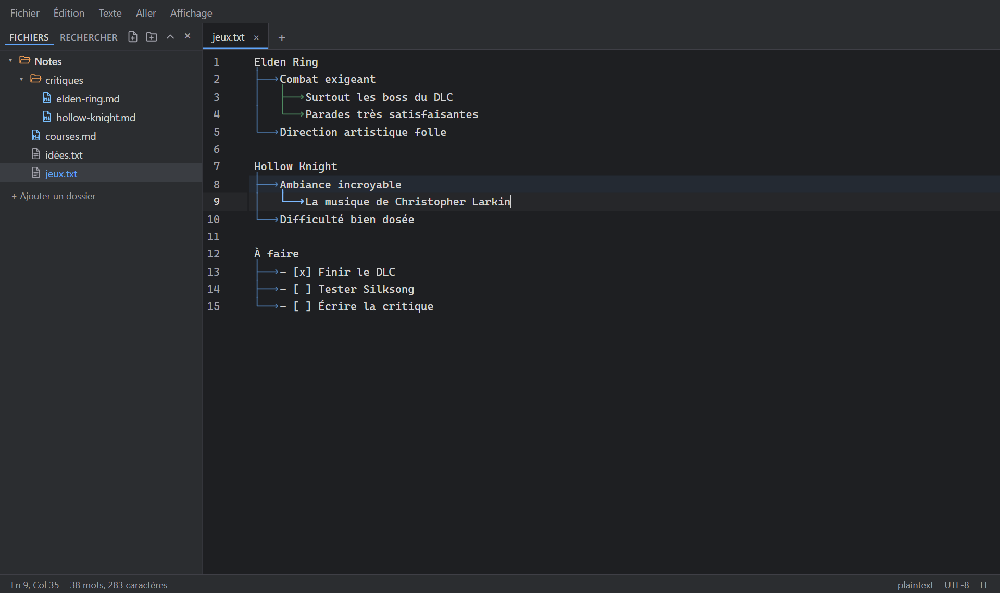
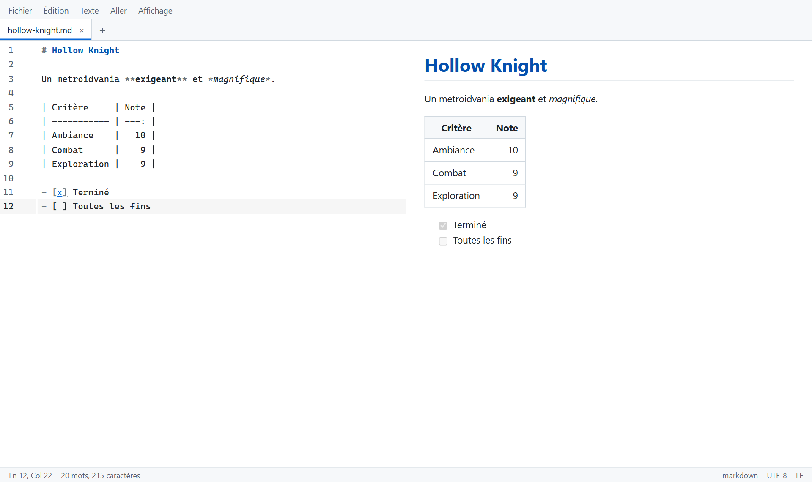
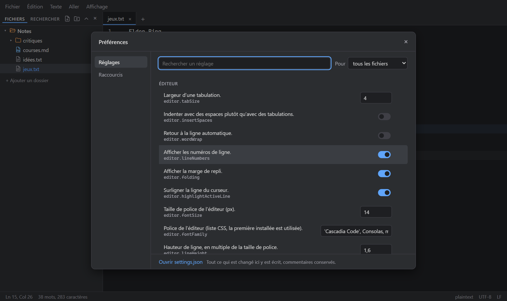

# cascades

**A light text editor for taking notes, that still opens any text or code file.**
The simplicity of Notepad++, the customization of Vim, a modern interface.

[Français](README.fr.md)



> In development (milestone 0.5). Windows first, then macOS and Linux. See [the roadmap](docs/ROADMAP.md).

## Cascades

You write notes line by line, and indent a line with Tab when it follows from the one above. cascades draws the connections:

```
Elden Ring
├──> Tough combat
│    ├──> Especially the DLC bosses
│    └──> Very satisfying parries
└──> Wild art direction
```

The file itself only holds tabs: the lines are drawn, never written, and copying text copies the tabs. Each parent line can be folded, the branch of the current line is highlighted, and there are eight styles (arrows, rounded, curves, dots, dashes…).

## Features

**Writing**

- Enter keeps the exact indentation, so cascades grow as you type.
- Smart lists (`-`, `*`, `1.`, `a)`, `- [ ]`): Enter continues the list, Tab and Shift+Tab change the level, numbers update themselves, Ctrl+Enter checks a task.
- Auto pairs for brackets and quotes (and `**`, `` ` `` in Markdown); type `(`, `"` or `*` over a selection to wrap it.
- Text menu: UPPERCASE, lowercase, Title Case, Sentence case; sort lines, remove duplicate lines, trim trailing spaces, join lines.
- Select a line (Ctrl+L, again for the next one), a whole cascade or paragraph (Leader L); bookmarks (Ctrl+F2, F2); go to line (Ctrl+G).
- Spell checking with the Windows dictionaries, on and off with F7; corrections on right-click.
- Lines changed since the last save are marked in the margin, like in Notepad++.
- Markdown tables: Tab moves between cells and aligns the columns. Ctrl+click opens links; pasting an address over selected text makes a Markdown link. Ctrl+; inserts the date.
- "Quarantine": set a passage aside (Leader Q) to try your text without it, and put it back anywhere later.

**Files**

- Tabs, split views (up to four, the same file in several views), and a session restored on start, unsaved tabs included: closing the window loses nothing.
- Explorer on the left with one or more folders: create, rename, send to the recycle bin. Quick open (Ctrl+P) over open tabs, recent files and every file of the folders.
- Search and replace in files (Ctrl+Shift+F), with a preview of each replacement.
- Encodings (UTF-8, UTF-16, Windows-1252…) and line endings kept on save; reopen or convert from the status bar. Files changed by another program reload, or merge with your changes.
- Big files open in a light mode; binary files in a read-only hex view.

**Viewers**



- Preview next to the editor or on its own (Ctrl+Shift+V): Markdown (tables, task lists, footnotes, colored code, local images), HTML (sandboxed), SVG, CSV and TSV as sortable tables, JSON as a tree.
- Images and PDF files open in a tab, with zoom; the text of a PDF can be selected.

**Making it yours**



- Seven themes (Light, Dark, High contrast, Solarized light and dark, Nord, Gruvbox) and your own; the system's light or dark mode is followed by default.
- A Preferences window (Ctrl+,) for every setting and every shortcut: type the new keys to change one.
- `settings.json` and `keybindings.json` (VS Code format) with completion and error checking, reloaded as you save.
- Hide the menu bar, tabs or status bar; zen mode for writing full screen.
- A leader key (Ctrl+Space) for more shortcuts, with a hint bar that shows what comes next.
- Everything is a command, in the command palette (Ctrl+Shift+P). An `init.js` script can add your own.

## Shortcuts

| Action                                    | Shortcut                                  |
| ----------------------------------------- | ----------------------------------------- |
| New / Open / Save                         | Ctrl+N / Ctrl+O / Ctrl+S                  |
| Save as                                   | Ctrl+Shift+S                              |
| Close tab / Reopen closed tab             | Ctrl+W / Ctrl+Shift+T                     |
| Next / previous tab                       | Ctrl+Tab / Ctrl+Shift+Tab                 |
| Quick open                                | Ctrl+P / Leader O                         |
| Command palette                           | Ctrl+Shift+P / Leader P                   |
| Preferences                               | Ctrl+,                                    |
| Find / Replace                            | Ctrl+F / Ctrl+H                           |
| Search in files                           | Ctrl+Shift+F                              |
| Add folder / Show or hide the left panel  | Ctrl+Shift+O / Ctrl+B                     |
| Go to line                                | Ctrl+G                                    |
| Bookmark: set / next / previous           | Ctrl+F2 / F2 / Shift+F2                   |
| Select line / remove the last one         | Ctrl+L / Ctrl+Shift+L                     |
| Select the cascade or paragraph           | Leader L                                  |
| UPPERCASE / lowercase                     | Ctrl+Shift+U / Ctrl+U                     |
| Title Case / Sentence case                | Leader U / Leader Shift+U                 |
| Duplicate line / Move line                | Shift+Alt+Down / Alt+Up, Alt+Down         |
| Delete line                               | Ctrl+Shift+K                              |
| Comment                                   | Ctrl+/ (Ctrl+: on AZERTY)                 |
| Add next occurrence                       | Ctrl+D                                    |
| Check or uncheck a task                   | Ctrl+Enter                                |
| Insert the date                           | Ctrl+;                                    |
| Spell checking on / off                   | F7                                        |
| Preview next to the editor / alone        | Ctrl+Shift+V or Leader V / Leader Shift+V |
| Split: clone to the next view             | Ctrl+\ or Leader S                        |
| Split: move to the next / previous view   | Ctrl+Alt+Right / Ctrl+Alt+Left            |
| Split: go to view 1 to 4 / join all views | Ctrl+1 … Ctrl+4 / Leader J                |
| Show or hide cascades / this block's      | Leader C / Leader Shift+C                 |
| Quarantine a passage / its panel          | Leader Q / Leader Shift+Q                 |
| Theme                                     | Leader T                                  |
| Zoom                                      | Ctrl+= / Ctrl+- / Ctrl+0, Ctrl+wheel      |
| Zen mode (Escape to leave)                | Leader Z                                  |
| Show or hide menus, tabs, status bar      | Leader M / Leader Tab / Leader B          |

**Leader** is the leader key, **Ctrl+Space** by default (setting `keyboard.leader`): press it, then the next key. A bar at the bottom of the window shows the keys that can follow.

## Configuration

The config folder is:

- Windows: `%APPDATA%\dev.cascades.app\`
- macOS: `~/Library/Application Support/dev.cascades.app/`
- Linux: `~/.config/dev.cascades.app/`

**Portable mode**: put an empty file named `portable` next to the executable; the config then lives in a `config` folder there.

### settings.json

Every setting can be changed in the Preferences window, which writes this file and keeps its comments. It can also be edited by hand (File > Open settings.json), with completion, error underlining and a description on hover:

```jsonc
{
  "editor.fontSize": 15,
  "cascades.style": "rounded",
  // Only for Markdown files:
  "[markdown]": { "editor.wordWrap": true },
}
```

A few useful ones:

| Key                   | Default                     | Description                                                         |
| --------------------- | --------------------------- | ------------------------------------------------------------------- |
| `editor.tabSize`      | `4`                         | Width of a tab                                                      |
| `editor.wordWrap`     | `false`                     | Wrap long lines                                                     |
| `editor.fontFamily`   | `'Cascadia Code', …`        | Editor font                                                         |
| `workbench.theme`     | `"auto"`                    | Theme, or `auto` to follow the system                               |
| `cascades.style`      | `"arrow"`                   | `arrow`, `rounded`, `curved`, `bullet`, `line`, `dashed`, `dotted`… |
| `cascades.languages`  | `["plaintext", "markdown"]` | Where cascades are drawn                                            |
| `files.autoSave`      | `"off"`                     | `afterDelay` saves changed files by itself                          |
| `explorer.exclude`    | `[".git", "node_modules"]`  | Names hidden in the explorer                                        |
| `spellcheck.language` | `"fr"`                      | Language of the spell checker                                       |
| `keyboard.leader`     | `"Ctrl+Space"`              | The leader key                                                      |

### keybindings.json

The VS Code format: shortcuts added to the default ones, or replacing them. A `-` before a command removes a shortcut.

```jsonc
[
  { "key": "Ctrl+Shift+N", "command": "file.new" },
  // Ctrl+D no longer selects the next occurrence
  { "key": "Ctrl+D", "command": "-editor.addNextOccurrence" },
  { "key": "Leader D", "command": "editor.duplicateLine", "when": "editorFocus" },
]
```

### Themes

A theme is a JSON file in the `themes` subfolder of the config folder. It sets the colors it wants; the others come from the base palette of its type:

```json
{
  "name": "Sepia",
  "type": "light",
  "colors": { "bg": "#f4ecd8", "fg": "#433422", "accent": "#a0522d", "syn-keyword": "#8b4513" }
}
```

`themes/sepia.json` becomes the theme `user.sepia` (Leader T to pick it), reloaded as you save. The list of colors is in [src/themes/default.css](src/themes/default.css).

### init.js

`init.js` is a JavaScript module loaded on start as an extension. It gets the same `ctx` object as the built-in features: commands, shortcuts, settings, tabs, the editor (CodeMirror 6), the status bar… A full example: [docs/examples/init.js](docs/examples/init.js).

```js
export default function (ctx) {
  ctx.commands.register('user.hello', () => ctx.dialogs.alert('Hello'));
  ctx.keybindings.register({ key: 'Leader H', command: 'user.hello' });
}
```

## Architecture

```
src/
├── core/        Kernel without UI: commands, shortcuts, settings, events, extension host
├── api/         The extension API (the plugin API to come)
├── app/         Wiring: workbench, tabs, CodeMirror integration
├── extensions/  Every feature, written against src/api only
├── platform/    Calls to the Tauri backend
└── ui/          Svelte components
src-tauri/       Rust backend: files, encodings, search, spell checking, config
```

Every feature is an extension activated with `activate(ctx)`; what it registers through `ctx` goes away when it is deactivated. A lint rule keeps extensions from importing anything but `src/api`.

Stack: [Tauri 2](https://tauri.app), TypeScript, [Svelte 5](https://svelte.dev), [CodeMirror 6](https://codemirror.net).

## Performance

Measured on 30/09/2026, Windows build 0.1.0:

- Installer 2.8 MB; installed program 6 MB.
- Interface ready about 120 ms after the window opens (35 ms when cached).
- Typing stays fluid in a 10,000-line file with cascades. Past 50 MB, light mode; past 512 MB, read-only.
- The PDF viewer, Markdown rendering and languages load on first use only.

## Development

Requirements: Node 20+, stable Rust, and on Windows the Visual Studio Build Tools (C++ workload). See the [Tauri prerequisites](https://v2.tauri.app/start/prerequisites/).

```sh
npm install
npm run tauri dev      # run the app
npm run tauri build    # build the installers
```

Checks:

```sh
npm run lint && npm run check && npm test
npm run test:e2e       # Playwright tests in a browser (frontend only)
cd src-tauri && cargo test && cargo clippy && cargo fmt --check
```

`npm run dev` runs the frontend alone in a browser, on an in-memory disk. `npm run screenshots` takes the pictures of this README.

## License

[MIT](LICENSE)
